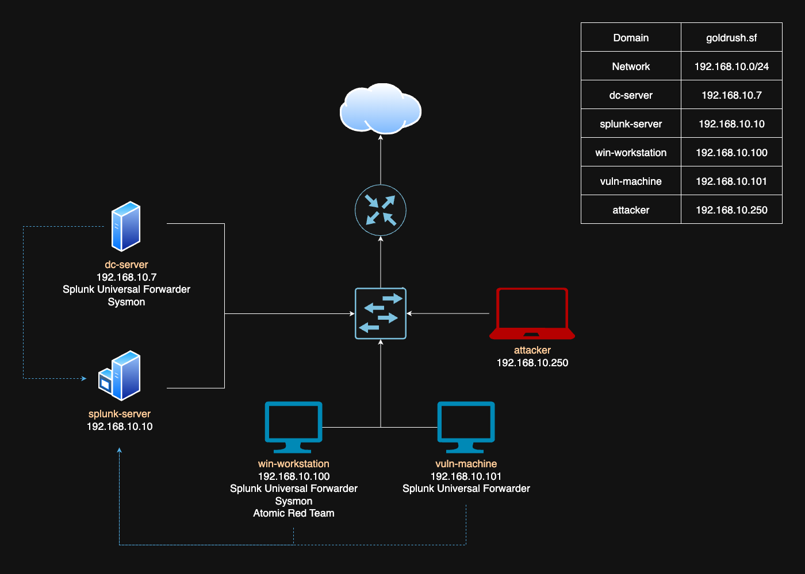

# SOC Home Lab

This project is heavily inspired by MyDFIR’s [Active Directory Project](https://www.youtube.com/watch?v=5OessbOgyEo&list=PLG6KGSNK4PuBWmX9NykU0wnWamjxdKhDJ&index=14) and serves as a playground for learning how to how configure various types of systems and services and perform, monitor, and defend against cyberattacks.

Topics and tools covered:
- Active Directory configuration and automation
- Sysmon
- Splunk
- Kali Linux
- Atomic Red Team
- Nessus Essentials

My goal is to continue to build on this home lab as I come across new topics and tools that I find interesting.

## Hardware
Below are the specs and software I have installed on my Dell Latitude 7300, which I used to setup this home lab:
- Windows 11 Pro
- 500GB storage
- Intel Core i7
- 32GB RAM
- Oracle VirtualBox

## Home Lab Topology

| Machine | Description |
|:----|:---|
| `dc-server` | Serves as the domain controller and provides authentication and authorization services for the Gold Rush organization. |
| `splunk-server` | Collects and manages machine-generated data for searching and analysis. |
| `win-workstation` | Serves as the workstation that Gold Rush employees log into.|
| `vuln-machine` | Serves as an intentionally vulnerable machine for vulnerability scanning and penetration testing. |
| `attacker` | Serves as the machine an attacker uses to exploit vulnerabilities in the Gold Rush network. |

- Both the Windows 10 machine and Active Directory server will have Sysmon installed to collect telemetry, which will be sent to the Splunk server via the Splunk Universal Forwarder.
- The Windows 10 machine will also have Atomic Red Team installed to simulate attacks and generate logs for monitoring.

## Parts
1. [Setting Up Virtual Machines](https://github.com/larryn-tech/homelab/blob/main/01-vm_setup.md)
2. [Configuring Active Directory and Domain Controller](https://github.com/larryn-tech/homelab/blob/main/02-active_directory.md)
3. [Configuring Splunk](https://github.com/larryn-tech/homelab/blob/main/03-splunk_configuration.md)
4. [Simulating Brute Force Attack and Atomic Red Team](https://github.com/larryn-tech/homelab/blob/main/04-attack.md)
5. [Login Hardening and Splunk Alerts](https://github.com/larryn-tech/homelab/blob/main/05-login_hardening.md)
6. [Adding a Metasploitable 2 to the Network](https://github.com/larryn-tech/homelab/blob/main/06-metasploitable.md)